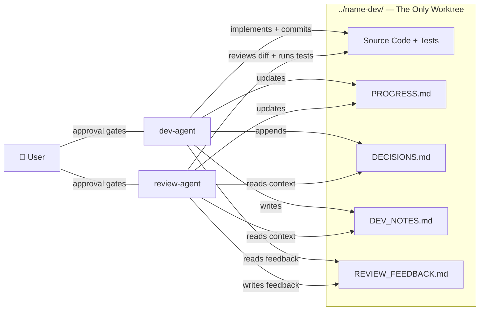

# Dev-Agent & Review-Agent — Workflow Scenarios Reference

> Last updated: 2025-04-13
> Architecture: Single dev worktree (`../<name>-dev/`) — no review worktree.

---

## Architecture Overview

### Shared Files (all in dev worktree)

| File | Written by | Read by | Purpose |
|------|-----------|---------|---------|
| `PROGRESS.md` | Both agents | Both agents | Single source of truth for workflow state |
| `DECISIONS.md` | dev-agent only | Both agents | Persistent cross-step decision log (append only) |
| `DEV_NOTES.md` | dev-agent only | review-agent | What was implemented, files changed, decisions, questions |
| `REVIEW_FEEDBACK.md` | review-agent only | dev-agent | APPROVED / CHANGES_REQUIRED + issues + suggestions |

---

## Scenario 1: Happy Path — First Pass Approval

| Step | Agent | Action | Details |
|------|-------|--------|---------|
| 1 | **User** | Starts the workflow | Tells dev-agent to implement Step N of `PLAN.md`, provides `<plan-name>` |
| 2 | **dev-agent** | Reads context | Reads `PLAN.md`, detects project stack, reads `PROGRESS.md` & `DECISIONS.md` if they exist |
| 3 | **dev-agent** | Creates dev worktree | `git worktree add "../<name>-dev" -b "feature/plan-<plan-name>"` |
| 4 | **dev-agent** | Implements Step N | Writes code following project conventions, stays within step boundaries |
| 5 | **dev-agent** | Writes `DEV_NOTES.md` | Documents what was done, files changed, decisions, questions for reviewer |
| 6 | **dev-agent** | Appends to `DECISIONS.md` | Logs any non-obvious choices made |
| 7 | **dev-agent** | Asks user for commit approval | Shows diff + summary → User approves |
| 8 | **dev-agent** | Commits | `git commit -m "feat(step-N): ..."` |
| 9 | **dev-agent** | Updates `PROGRESS.md` | Marks Step N as 🔄 In Progress (awaiting review) |
| 10 | **User** | Switches to review | Tells review-agent to review Step N |
| 11 | **review-agent** | Locates dev worktree | `DEV_WORKTREE="../<name>-dev"` — no worktree creation needed |
| 12 | **review-agent** | Reads context | Reads `PLAN.md`, `PROGRESS.md`, `DECISIONS.md`, `DEV_NOTES.md` — all from dev worktree |
| 13 | **review-agent** | Reviews diff + code | `cd "$DEV_WORKTREE" && git diff main...HEAD`, reads files in context, runs tests & linters |
| 14 | **review-agent** | Writes `REVIEW_FEEDBACK.md` | Status: **APPROVED**, lists ✅ approved items |
| 15 | **review-agent** | Updates `PROGRESS.md` | Keeps Step N as 🔄 In Progress (awaiting user approval) |
| 16 | **review-agent** | Asks user for review approval | Presents summary → User approves |
| 17 | **review-agent** | Marks step complete | Updates `PROGRESS.md` → Step N: ✅ Complete |
| 18 | **User** | Decides next step | Tells dev-agent to proceed to Step N+1 (or stops) |

---

## Scenario 2: Review Finds Issues — One Iteration Fix

| Step | Agent | Action | Details |
|------|-------|--------|---------|
| 1–9 | *(same as Scenario 1)* | Dev implements, commits, updates `PROGRESS.md` 🔄 | All in dev worktree |
| 10 | **User** | Switches to review | Tells review-agent to review Step N |
| 11 | **review-agent** | Locates dev worktree + reads context | `DEV_WORKTREE="../<name>-dev"`, reads all shared state |
| 12 | **review-agent** | Reviews diff + code | Finds bugs, missing tests, or unmet plan requirements |
| 13 | **review-agent** | Writes `REVIEW_FEEDBACK.md` | Status: **CHANGES_REQUIRED**, lists ❌ blocking issues with fix instructions |
| 14 | **review-agent** | Updates `PROGRESS.md` | Step N: 🔄 In Progress, Iteration 1/5 |
| 15 | **review-agent** | Asks user for review approval | User approves the review → dev-agent should address feedback |
| 16 | **User** | Switches to dev | Tells dev-agent to address review feedback |
| 17 | **dev-agent** | Reads `REVIEW_FEEDBACK.md` | Evaluates each issue: verifies factual claims, assesses severity |
| 18 | **dev-agent** | Fixes valid issues | Makes code changes to address blocking issues |
| 19 | **dev-agent** | Disputes incorrect feedback (if any) | Notes in `DEV_NOTES.md` under "Review feedback respectfully disputed" with reasoning |
| 20 | **dev-agent** | Updates `DEV_NOTES.md` | Documents what was changed, what was disputed |
| 21 | **dev-agent** | Appends new decisions to `DECISIONS.md` | If any new decisions made during fixes |
| 22 | **dev-agent** | Asks user for commit approval | Shows new diff → User approves |
| 23 | **dev-agent** | Commits | `git commit -m "feat(step-N): address review feedback iteration 2"` |
| 24 | **dev-agent** | Updates `PROGRESS.md` | Iteration 2/5 |
| 25 | **User** | Switches to review again | Tells review-agent to re-review |
| 26 | **review-agent** | Re-reviews | Reads updated `PROGRESS.md`, `DECISIONS.md`, `DEV_NOTES.md` from dev worktree; reviews `git diff HEAD~1 HEAD` |
| 27 | **review-agent** | Verifies dispute resolution | Re-reads code carefully, accepts valid disputes, rejects invalid ones with explanation |
| 28 | **review-agent** | Writes updated `REVIEW_FEEDBACK.md` | Status: **APPROVED** (all issues resolved) |
| 29 | **review-agent** | Updates `PROGRESS.md` | Keeps 🔄 In Progress, asks user for review approval |
| 30 | **User** | Approves review | review-agent marks Step N: ✅ Complete |

---

## Scenario 3: Multi-Step Project Lifecycle

| Phase | Agent | Action | Where |
|-------|-------|--------|-------|
| **Planning** | **User** | Creates `PLAN.md` with steps as `##` headings | Project root |
| **Step 1: Dev** | **dev-agent** | Creates dev worktree, implements Step 1 | `../<name>-dev/` |
| **Step 1: Review** | **review-agent** | Works in same dev worktree, reviews Step 1 | `../<name>-dev/` |
| **Step 1: Iterate** | *(loop)* | Fixes → Re-review (up to 5 iterations) | `../<name>-dev/` |
| **Step 1: Complete** | **review-agent** | Marks ✅ Complete after user approval | `../<name>-dev/PROGRESS.md` |
| **Step 2: Dev** | **dev-agent** | Reuses existing dev worktree, reads `PROGRESS.md` + `DECISIONS.md` for context | `../<name>-dev/` |
| **Step 2: Review** | **review-agent** | Same dev worktree, reads all shared state including Step 1 decisions | `../<name>-dev/` |
| **Step 2: Complete** | **review-agent** | Marks ✅ Complete | `../<name>-dev/PROGRESS.md` |
| **...** | *(repeat)* | Steps 3, 4, ... each following same pattern | All in `../<name>-dev/` |
| **Final** | **User** | Approves all steps, asks dev-agent to clean up worktree | `git worktree remove "../<name>-dev"` |

---

## Scenario 4: User Changes Plan Mid-Workflow

| Step | Agent | Action | Details |
|------|-------|--------|---------|
| 1 | **User** | Updates `PLAN.md` | Adds/removes/modifies steps or requirements |
| 2 | **Current agent** | Re-reads plan from scratch | Does NOT assume plan is unchanged |
| 3 | **Current agent** | Acknowledges changes | Confirms understanding to user |
| 4 | **dev-agent** (if mid-step) | Assesses alignment | Checks if current implementation still fits modified requirements |
| 5 | **review-agent** (if reviewing) | Adjusts review criteria | Re-evaluates implementation against new requirements |
| 6 | *(resume normal flow)* | Continue with modified plan | |

---

## Scenario 5: Max Iterations Reached (5/5)

| Step | Agent | Action | Details |
|------|-------|--------|---------|
| 1 | **review-agent** | Iteration count hits 5/5 | Still has blocking issues after 5 rounds |
| 2 | **review-agent** | Escalates to user | "After 5 iterations, issues remain. How would you like to proceed?" |
| 3 | **User** | Makes a judgment call | Options: adjust plan, skip issue, give different direction, or continue |
| 4 | *(resume based on user decision)* | | |

---

## Design Principles

| Principle | How It Works |
|-----------|-------------|
| **User is the gatekeeper** | Neither agent can commit (dev) or finalize review (reviewer) without explicit user approval |
| **Shared state via files** | `PROGRESS.md`, `DECISIONS.md`, `DEV_NOTES.md`, `REVIEW_FEEDBACK.md` — just markdown |
| **Single worktree** | Only `../<name>-dev/` exists — review-agent works in it, no branch conflicts |
| **Separation of concerns** | Dev writes code; reviewer writes feedback. Reviewer never makes code changes |
| **Persistent decisions** | `DECISIONS.md` accumulates across all steps so context is never lost |
| **Bounded iteration** | Max 5 review cycles per step, then escalate to user |
| **Independent verification** | Dev-agent verifies review feedback before implementing; review-agent re-verifies disputes |
| **User controls pacing** | Agents never auto-advance to the next step — user explicitly decides |
